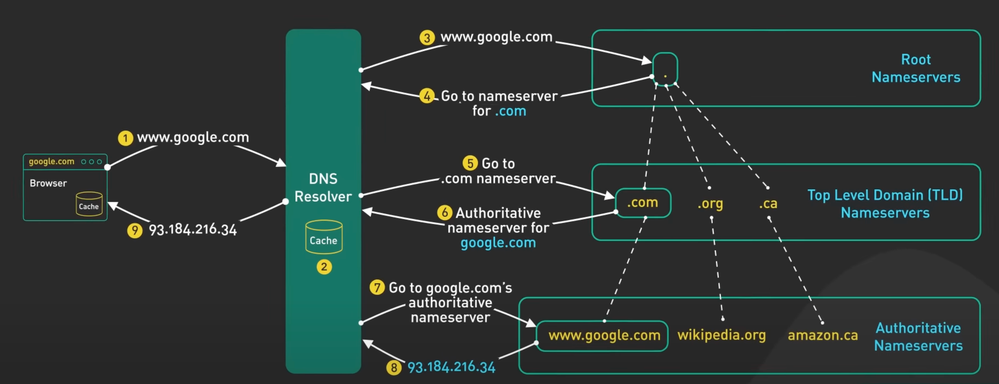

Have you been in a scenario when you look at a website in your phone and it works. Meanwhile, one of your colleages is looking at it in their PC and they get a response saying this site doesn't exist. That's probably a DNS (Domain Name System) issue.

DNS is akin to the internet's phonebook. It's easy to remember a website's name, like www.ssw.com.au, but computers and networks need numerical IP addresses to access websites. DNS translates human-readable domain names to machine readable IP addresses.

<!--endintro-->

### DNS explained

`youtube: https://www.youtube.com/embed/27r4Bzuj5NQ`
**Video: Everything You Need to Know About DNS (5 min)**
        
Understanding DNS is crucial for troubleshooting connectivity issues, optimizing network performance, and ensuring secure internet navigation.

When you type a URL into your browser and the IP address for that URL isn't known, then the browser will do a DNS look up to figure it out. The answers are present with the authoritative name servers. When we update a domains DNS records as a site owner we are updating its authoritative name server.

**Important:** A DNS resolver and a DNS server are not the same, A DNS resolver translates domain names into IP addresses for end-users, while a DNS server stores and provides the domain name information.

But how does the DNS resolver find the correct authotritative name server?, this is where the system of DNS get instresting. Here is how it works:

- **Domain Name Input:** When you type a web address into your browser, the DNS process begins. Your browser requests the DNS to translate the human-friendly domain name into a machine-friendly IP address.

- **DNS resolver query:** Your computer sends this request to a DNS resolver, typically operated by your ISP (Internet Service Provider). If the resolver doesn't have the IP address cached, it queries further.

- **Root Nameserver Query:** The resolver contacts a root nameserver, which stores the IP address of all the Top-Level Domain (TLD) nameservers and responds with the correct one based on the TLD of the requested domain (e.g., `.com`, `.au`).

- **TLD Nameserver Query:** The resolver then asks the TLD nameserver for the authoritative nameserver of the domain, which holds the actual IP address.

- **Authoritative Nameserver Response:** The authoritative nameserver provides the IP address for the requested domain to the resolver.

- **Resolver Caching:** The resolver caches the IP address for a predetermined time, determined by the Time to Live (TTL), to improve response times for future queries to the same domain.

- **Browser Connection:** With the IP address now known to your machine, your browser can establish a connection to the web server hosting the domain and load the website.

**Note:** The resolver's queries to root, TLD, and authoritative nameservers are recursive, meaning each server points to the next server in the chain until the IP address is found.

### Comman DNS record types

In the context of DNS (Domain Name System), a "type" refers to the kind of DNS record in a DNS server's database, here are some comman ones:

| Type                                  | Function                                                   | Common Example                                   |
|---------------------------------------|------------------------------------------------------------|--------------------------------------------------|
| **Address Record (A)**                | Maps a domain to an IPv4 address.                          | `example.com` maps to `93.184.216.34`            |
| **IPv6 Address Record (AAAA)**        | Maps a domain to an IPv6 address.                          | `example.com` maps to `2606:2800:220:1:248:1893:25c8:1946` |
| **Canonical Name Record (CNAME)**     | Maps a domain to another domain name (aliasing).           | `www.example.com` aliases to `example.com`       |
| **Mail Exchange Record (MX)**         | Specifies mail servers for a domain.                       | `example.com` mail handled by `mail.example.com` |
| **Name Server Record (NS)**           | Delegates a subdomain to a set of name servers.            | `sub.example.com` delegated to `ns1.example.com` |
| **Pointer Record (PTR)**              | Maps an IP address to a domain (reverse DNS).              | `34.216.184.93` reverses to `example.com`        |
| **Start of Authority Record (SOA)**   | Stores administrative information about a zone.            | `example.com` SOA record indicates `ns1.example.com` as primary NS |
| **Service Locator Record (SRV)**      | Specifies services available in a domain.                  | `_sip._tcp.example.com` points to SIP server at `sipserver.example.com` port 5060 |
| **Text Record (TXT)**                 | Holds text information for external sources to read.       | `example.com` uses a TXT record for SPF: `"v=spf1 include:_spf.example.com ~all"` |

DNS is a foundational internet technology, enabling the seamless translation of domain names into IP addresses, making it easier for users to access websites without memorizing complex numerical addresses.
